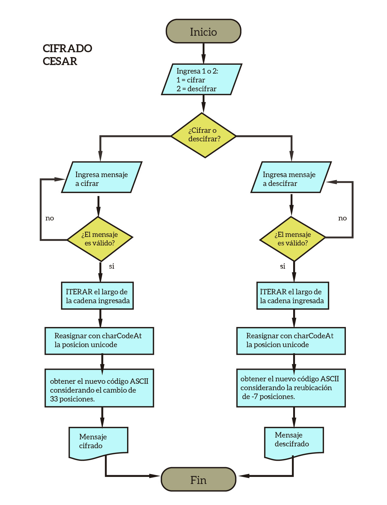

# Read me
En esta mini-aplicación, vamos a aplicar el algoritmo de Cifrado de Caesar para cifrar y descifrar mensajes ingresados por el usuario a través de un prompt.

## Reglas
* El programa es capaz de cifrar y descifrar mensajes que contengan letras mayúsculas y letras minúsculas.
* El usuario no puede ingresar campos vacíos.
* El mensaje no debe contener números.

## Pseudo-código

```
1. Prompt solicitando elegir opción 1 para cifrado u opción 2 para decifrado:
     1.1. Si el usuario ingresa algo diferente a 1 o 2, le vuelve a pedir una opción válida.
2. Con otro prompt solicitar un mensaje para cifrar
     2.1. Verificar si la cadena ingresada es válida con mensajeValido()
     2.2. Si es valido, invocar a la función cipher()
     2.3. si no es valido, ingresar otro mensaje
	
3. Mostrar otro prompt solicitando un mensaje a descifrar
    3.1. Verificar si la cadena ingresada es válida con mensajeValido()
	3.2. si es valida invocar a la función decipher()
    3.3. si no es valido, ingresar otro mensaje
  	

4. Función cipher()
    4.1. Declarar una variable vacia mensajeCifrado
    4.2. Declarar una variable en cero posicionUnicode
    4.3.ITERAR en FOR el largo de la cadena ingresada
    4.4.  Reasignar con charCodeAt la posicion unicode de la palabra actual.
    4.5. Reasignar la posición unicode para obtener el nuevo código ASCII considerando el cambio de 33 posiciones en el alfabeto.
    4.6. Concatenar a mensajeCifrado el nuevo caracter cifrado
    4.7. MOSTRAR con alert el valor mensajeCifrado

5. Función descipher()
    5.1 Declarar una variable vacia mensajeDescifrado
    5.2 Declarar una variable en cero posicionUnicode
    5.3 ITERAR en FOR el largo de la cadena ingresada
    5.4 Reasignar con charCodeAt la posicion unicode de la palabra actual.
    5.5 Reasignar la posición unicode para obtener el nuevo código ASCII considerando la reubicación de -7 posiciones.
    5.6 Concatenar a mensajeDescifrado el nuevo caracter desccifrado
    5.7 MOSTRAR con alert el valor mensajeDescifrado

6. Fin

 

````