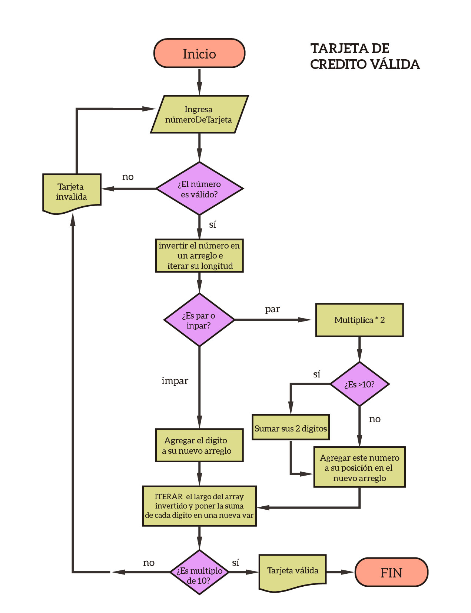

# Read me
En esta mini-aplicación, vamos a aplicar el algoritmo de Luhn para informarle al usuario si el número que ingreso es el de una tarjeta de crédito válida

## Reglas
* El usuario no puede ingresar campos vacíos.

## Pseudo-código
```
1. Prompt solicitando el número de tarjeta
2. Mandar este número como argumento a la función isValidCard()

3. Función isValidCard()
4. Si es un campo vacio entonces:
   MOSTRAR un mensaje de error
5. Si no es un campo vacío entonces:
   Pasar los números a un array en orden inverso
   e ITERAR en FOR el largo del nuevo array inverso
6. Si la posición actual es impar, agregar el dígito a un nuevo arreglo
7. Si la posición actual es par, multiplicar por dos este dígito
   7.1. Si el dígito al doble es mayor a diez, sumar sus dos dígitos y agregar       este número a su posición en el nuevo arreglo
   7.2. Si el dígito al doble es menor a diez, agregar este número a su posición en  el nuevo arreglo
8. ITERAR en FOR el largo del array inverso con sus nuevas posiciones y poner   
   la suma de cada dígito en una nueva variable
9. Si la suma de los dígitos es múltiplo de 10
    MOSTRAR mensaje indicando que la tarjeta es válida
10. Si no MOSTRAR mensaje indicando que la tarjeta no es válida
  	
11. FIN

````
